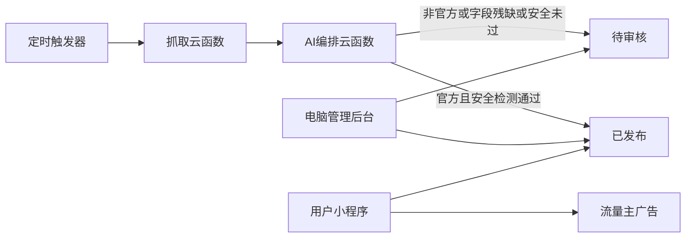

# 新能源车型速览小程序设计

日期：2026-08-15  
状态：待用户审阅  
范围：第一版（可过审上线、可自动更新官方新车速览、可预留广告）

**产品名称：** 中文 **新车速览**，英文 **NEV Glance**。微信公众平台注册与导航栏用中文名；仓库与云环境可用英文名。注册时若中文名被占用，备选「绿牌速览」。

## 1. 背景与目标

作者是 C++ 视音频渲染工程师，首次做微信小程序。产品用粉丝访问换微信流量主分成，不靠卖货。

第一版成功标准：

- 用户能按品牌浏览国内新能源新车速览，能登录后关注品牌、收藏动态。
- 官方公开信息能定时抓取，并由 AI 编排成统一字段；官方源在内容安全通过后自动上架。
- 不自购云服务器；开发与小流量运营走微信云开发。
- 对外定位是「新能源车型速览 / 用车信息整理」，不是新闻站，不整篇转载第三方媒体。

## 2. 产品范围

### 2.1 做

- 四大品牌族谱的新车动态（预热 / 预售 / 上市 / 改款、价格文案、核心卖点速览）。
- 微信一键登录、关注品牌桶、收藏动态。
- 电脑网页后台：待审核队列、抓取日志、手工补发、上架/下架。
- 发现页两个占位入口：车机软件、用车好物（文案「即将上线」）。
- 流量主 Banner 位预留，默认关闭。

### 2.2 品牌与筛选

首页主筛选是四个品牌桶；子品牌是二级筛选。

| 品牌桶 | 子品牌 |
| --- | --- |
| 比亚迪 | 比亚迪、腾势、仰望、方程豹 |
| 吉利 | 吉利、领克、极氪 |
| 华为系列 | 问界、智界、享界、尊界、尚界 |
| 小米 | 小米（含 SU7 / YU7 / 澎程） |

界面与文案写「华为系列」或具体子品牌（问界等），不写「华为汽车」。关注对象是品牌桶：关注「比亚迪」即覆盖该桶下全部子品牌动态。

标签筛选（可多选）：SUV、轿车、MPV、增程、纯电、插混。领克等站若扫到燃油车型页，流水线直接丢弃，不入库。

### 2.3 明确不做

整篇转载汽车之家 / 懂车帝 / 易车 / 公众号；大规模爬虫或绕过反爬；非官方源自动上架；评论与用户发帖；车机 / 好物正文；支付与电商；激励视频；自购云服务器；花钱投放获客。

## 3. 架构

- 用户端：原生小程序（WXML / WXSS / JS），微信开发者工具开发。
- 管理端：云开发静态网站托管的网页，账号密码登录，不单独买域名、不做 ICP 备案。
- 后端：微信云开发。云函数负责任务与权限；小程序只读已发布数据。
- 第一版不买 VPS。抓取默认跑在云函数定时触发器。若官方站拦截云函数 IP，再退到 GitHub Actions 或本机定时脚本写库；仍不够才考虑 2 核 2G 轻量机。后两档不是第一版默认路径。

### 3.1 云开发费用（以当时控制台为准）

- 未发布：可用免费云环境。
- 发布后约 15 天免费环境到期，转基础套餐约 19.9 元/月。
- 抓取只拉列表和正文，封面优先存官方图片 URL；仅在 URL 无法展示时转存一张封面。控制外网出流量（基础套餐约 2GB/月）。
- 频率低：每 6 小时一轮，只访问白名单域名。不把云环境当爬虫集群。

## 4. 用户端

三个底部 Tab。

### 4.1 动态

已发布动态的信息流，按发布时间倒序。可筛品牌桶、子品牌、标签。列表展示封面、标题、子品牌、上市状态、价格文案、摘要。每隔 5 条预留一条 Banner 槽位；广告未开通时不渲染、不留白。

### 4.2 详情

封面、标题、发布时间、品牌桶、子品牌、标签、上市状态、价格文案、正文、来源说明（含原文链接）、收藏。正文结束后预留 Banner。未登录点收藏则先拉起微信登录，成功后继续收藏。

### 4.3 发现

两个占位卡片：车机软件、用车好物，文案「即将上线」，点击 toast 即可。

### 4.4 我的

展示登录态。未登录显示「微信一键登录」。已登录显示我的关注（品牌桶列表，可取消）、我的收藏（动态列表）。浏览动态不强制登录。

## 5. 数据模型

集合均在云数据库。字段名用英文；下列为逻辑字段。

### 5.1 `brands`

- `bucketId`：`byd` / `geely` / `huawei` / `xiaomi`
- `subBrandId`：如 `denza`、`zeekr`、`aito`
- `name`、`sort`、`enabled`

### 5.2 `posts`

- `bucketId`、`subBrandId`
- `title`、`cover`、`summary`、`body`
- `launchStatus`：`teaser` / `presale` / `launched` / `facelift`
- `priceText`：如「23.99 万起」，纯文本
- `tags`：字符串数组
- `sourceNote`、`sourceUrl`、`sourceType`：`official` / `unofficial`
- `status`：`draft` / `pending_review` / `published` / `offline`
- `origin`：`manual` / `pipeline`
- `contentHash`：去重
- `publishedAt`、`createdAt`、`updatedAt`
- `reviewReason`：进入待审核的原因（安全未过 / 字段残缺 / 非官方 / 编排失败）

用户端列表与详情只查询 `status === published`。

### 5.3 `users`

- `_openid`
- `createdAt`
- 不强制存微信头像昵称；若用户授权再写 `nickName`、`avatarUrl`。

### 5.4 `follows`

- `_openid`、`bucketId`、`createdAt`
- 同一用户同一品牌桶唯一。

### 5.5 `favorites`

- `_openid`、`postId`、`createdAt`
- 同一用户同一动态唯一。

### 5.6 `admins`

- `username`
- `passwordHash`
- 第一版只建一个管理员账号，在云开发控制台写入，不提供自助注册。

### 5.7 `ingest_sources`

- `bucketId`、`subBrandId`
- `domain`、`entryUrl`
- `kind`：`news_list` / `model_page`
- `enabled`

### 5.8 `ingest_raw`

- `sourceId`、`pageUrl`、`fetchedAt`
- `rawText`（截断后的可见文本，不存完整巨型 HTML）
- `contentHash`
- `fetchStatus`：`ok` / `skip_dup` / `error`
- `errorMessage`

## 6. 官方来源白名单

只允许这些域名的公开页被标为 `official` 并自动上架。入口 URL 放在 `ingest_sources`，官网改版只改数据。下列为 2026-08 种子，实现时逐条探测。

### 6.1 比亚迪桶

- 比亚迪：`www.byd.com` — `https://www.byd.com/cn/news`，兜底 `https://www.byd.com/cn` 车型页
- 腾势：`www.denza.com` — `https://www.denza.com/cn`（只抓中国站）
- 仰望：`www.yangwangauto.com` — `https://www.yangwangauto.com/cn`
- 方程豹：`www.fangchengbao.com` — `https://www.fangchengbao.com/`

### 6.2 吉利桶

- 吉利：`dh.geely.com`、`www.geely.com`、`www.geelyauto.com.hk` — `https://dh.geely.com/Home`；港股新闻 `https://www.geelyauto.com.hk/zh-cn/新闻/`
- 领克：`www.lynkco.com.cn` — `https://www.lynkco.com.cn/`（丢弃燃油）
- 极氪：`www.zeekrlife.com`、`www.zeekrgroup.com` — `https://www.zeekrlife.com/zh-cn/home`；`https://www.zeekrgroup.com/news`

### 6.3 华为系列桶

- 域名：`hima.auto`、`aito.auto`
- 总入口：`https://hima.auto/`
- 问界：`https://aito.auto/` ，车型示例 `https://hima.auto/wenjie/m7-new/`
- 智界：`https://hima.auto/zhijie/`
- 享界：`https://hima.auto/xiangjie/`
- 尊界：`https://hima.auto/zunjie/s800/` 及同目录新车型
- 尚界：`https://hima.auto/shangjie/`

### 6.4 小米桶

- `www.xiaomiev.com` — `https://www.xiaomiev.com/`

白名单以外的域名第一版不抓。误入则 `sourceType = unofficial`，只进 `pending_review`，且默认流水线不应产生这类记录。

## 7. 内容流水线

### 7.1 步骤

1. 定时触发（每 6 小时）读取 `ingest_sources` 中 `enabled` 的入口。
2. 抓取列表或车型页可见文本。优先新闻列表；无稳定列表则对比车型页标题、价格文案、预售/上市状态是否变化。
3. 用 `pageUrl` 与 `contentHash` 去重；重复写入 `ingest_raw` 为 `skip_dup`，不再编排。
4. 调用 `compose(raw) -> postDraft`：输出第 5.2 节字段。必须改写，禁止整篇粘贴原文。
5. 判定：
   - 域名在白名单且 `sourceType = official`，且标题、品牌桶、正文均非空，且内容安全通过 → `published`，写入 `publishedAt`。
   - 否则 → `pending_review`，写清 `reviewReason`。
6. 燃油车型（标题或正文明确为燃油且无纯电/电混/增程）丢弃，不建 `posts`。

### 7.2 `compose` 接口

输入：`rawText`、`pageUrl`、`bucketId`、`subBrandId`。  
输出：`title`、`summary`、`body`、`launchStatus`、`priceText`、`tags`、`sourceNote`。  
实现可替换：第一版可用云开发套餐内模型或规则抽取 + 轻量模型；以后换更强 AI 只改云函数，不改小程序。模型失败或输出缺标题/品牌 → 待审核。

### 7.3 内容安全

自动上架与后台「发布」都必须先调微信内容安全接口（文本；若有自传封面则加图片）。不通过不得变为 `published`。

## 8. 管理后台

浏览器打开云开发静态站点。登录后可：

- 看待审核列表：AI 稿、原文链接、原因；发布 / 丢弃 / 编辑后再发。
- 看已发布 / 已下架，支持下架。
- 看抓取日志：最近成功时间、失败、重复跳过；连续失败标红。
- 手工新建一条（`origin = manual`），仍走内容安全后发布或存草稿。

不在小程序用户端做管理入口。

## 9. 用户数据流与失败处理

- 打开小程序即可读已发布动态。关注或收藏时 `wx.login`，云函数用 openid upsert `users`。
- 登录失败：仍可浏览；提示登录失败，不写关注/收藏。
- 网络失败：toast「网络异常，请重试」。
- 空列表：空状态「暂时还没有动态」。
- 广告加载失败：隐藏广告槽，不留大块空白。
- 抓取失败：只记日志，不影响已上线内容。

## 10. 流量主

盈利路径是流量主（展示微信广告分成），不是广告主投放（花钱买量）。第一版不买量。

代码预留两个 Banner：`adUnitIdFeed`、`adUnitIdDetail`，配置为空则不渲染。开通后再填 unit-id 并提审。

开通路径：小程序已发布 → 公众平台「流量主」显示达标（常见累计 UV 约 500～1000，以当时后台为准，禁止刷量）→ 开通并填财务资料 → 新建两个 Banner 广告位 → 把 unit-id 写入配置。

结算以开通时[官方说明](https://ad.weixin.qq.com/docs/293)为准：半月结；个人代扣税后约 15 个工作日打银行卡，无需手动提现。日活很低时月收入可能只有几十元，不一定覆盖 19.9 元云开发成本。

## 11. 主体与类目

可先用个人主体注册，尽快上线验证。若确定以后做小商品，同步办个体工商户，避免迁主体导致流量主要重开。

小程序类目选个人主体当时允许、且接近「生活信息 / 查询工具」的项，不选需要新闻许可的资讯新闻类。简介写「新能源车型上市与价格速览」，不写「新闻聚合」。

## 12. 测试（第一版手测）

微信开发者工具 + 真机：

- 未登录可浏览、筛选；关注/收藏会拉起登录；登录失败仍可看。
- 关注品牌桶后，「我的」能看到并取消；收藏/取消收藏与详情按钮一致。
- 发现页占位 toast。
- 广告配置为空时无空白坑；填测试 unit-id 后位置正确。
- 流水线：同一 URL 不重复上架；白名单官方页可自动发布；缺字段或安全拦截进待审核；燃油领克页不入库。
- 后台：待审核发布/丢弃/编辑；手工新建；下架后用户端不可见。

## 13. 以后可以换、第一版不必改用户端的部分

- 更强的 `compose` 模型。
- 增加非官方源（只许进待审核）。
- 充实车机软件、用车好物。
- 抓取从云函数迁到 CI 或轻量服务器。
