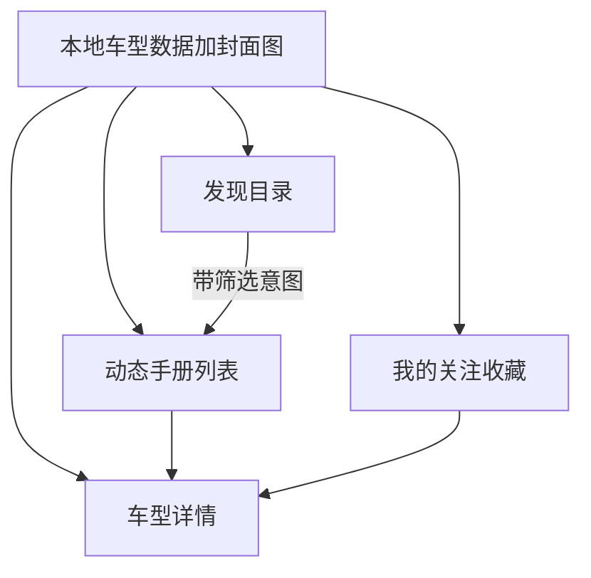

# 看Car 车型手册 UI 改版设计

日期：2026-08-20  
状态：待用户审阅  
范围：在**不使用云服务、本地数据、手动发版**的前提下，把动态/详情/发现从「文字信息流」改成「选车速览手册」。

**产品名：** 看Car（AppID `wxb2f1332cae0882b1`）。英文/仓库名 NEV Glance。

对照稿（已确认）：动态用纵向大封面卡；详情为封面+价格+三栏参数+要点；发现为动力/品牌目录。

## 1. 背景与目标

当前问题：

- 动态是三排 chips + 纯文字卡片，没有车图，首屏被筛选占满。
- 详情是一段官网摘录，不像车型页。
- 发现只有「车机软件 / 用车好物 · 即将上线」，显得空。
- 视觉是浅绿灰微信模板，不像新能源选车手册。

已确认方向（对话 + 浏览器对照稿）：

| 项 | 选择 |
| --- | --- |
| 气质 | 选车速览手册：浅色、大封面、价格/动力/状态一行说清，不像资讯站 |
| 一条卡片 | 一款车（汉、夏、D9…），不是一篇「更新」 |
| 封面 | 压缩图打进小程序包，真机不依赖域名 |
| 发现 | 按动力、按品牌进入同一批车，不做空占位 |
| 列表形态 | **A 纵向大封面**（不是左图右文） |

成功标准：

- 打开动态，在「全部」下能看到带封面的车型卡；点比亚迪能看到汉、夏、腾势、仰望、方程豹对应卡片。
- 点卡片进入手册式详情：车名、指导价、状态/动力/车身、3 条要点、来源复制、本机收藏。
- 发现页格子能跳到带筛选的动态，不再出现「即将上线」空卡片。
- 仍不调用 `wx.request` / `wx.cloud`；关注收藏仍只存本机。
- 文案不出现「华为汽车」；不做成汽车报价大全或新闻聚合。

## 2. 产品范围

### 2.1 做

- 重做动态列表：两行筛选（品牌桶 + 动力），纵向封面车型卡。
- 重做详情：手册结构（见第 4 节）。
- 重做发现：动力四宫格 + 四品牌入口，全部指向同一份车型数据。
- 「我的」沿用关注/收藏逻辑，收藏项改为短标题+缩略图，登录文案保持「开始使用」。
- 把 [`miniprogram/utils/posts-data.js`](miniprogram/utils/posts-data.js) 改成**车型记录**（见第 5 节），约 12–16 款，覆盖四品牌桶。
- 为每款车准备一张本地封面（`miniprogram/assets/models/`），JPEG/WebP 压缩，单张尽量 ≤ 80KB，合计控制在主包可接受范围。
- 继续用 [`miniprogram/app.wxss`](miniprogram/app.wxss) 已有 token（`#0b6e4f` 品牌绿、浅底白卡）。

### 2.2 品牌与筛选（与现产品一致，交互收紧）

| 品牌桶 | 子品牌（详情/卡片副标题用，动态第一版不强出第三排 chips） |
| --- | --- |
| 比亚迪 | 比亚迪、腾势、仰望、方程豹 |
| 吉利 | 吉利、领克、极氪 |
| 华为系列 | 问界、智界、享界、尊界、尚界 |
| 小米 | 小米 |

动态筛选只有两行：

1. 全部 / 比亚迪 / 吉利 / 华为系列 / 小米  
2. 全部动力 / 纯电 / 插混 / 增程  

SUV、轿车、MPV 作为详情标签与卡片小标签展示，**不再作为动态多选筛选**，避免再把列表滤空。

点品牌时清空动力筛选。空列表保留「清除筛选」。

发现页「按动力看 / 按品牌看」等于给动态带上对应 `bucketId` 或动力标签后 `switchTab`/`reLaunch` 到动态（小程序 tab 页用 `wx.setStorageSync` 传筛选意图，或非 tab 的中间页；实现时选一种，推荐：写入 `kancar_feed_intent` 后 `switchTab` 到动态，`onShow` 读取并清掉）。

### 2.3 明确不做（本改版）

- 不上云、不封装 `wx.request`、不引入 Vant/TDesign。
- 不恢复「车机软件 / 用车好物」入口（以后单独做）。
- 不做车型对比、配置表、经销商、支付。
- 不爬汽车之家/懂车帝；不整篇转载。
- 不用未授权的官网实拍大图；封面用自绘/生成的示意车图或品牌色块+车名（优先有图，缺图时色块兜底）。
- 不改自定义导航栏；仍用默认「看Car」标题栏。
- 价格数字为整理自公开指导价的「约 x.xx 万起」，详情注明以官网为准。

## 3. 信息架构

Tab 仍是：动态 / 发现 / 我的。详情为栈上页。

## 4. 页面设计

### 4.1 动态

- 顶：两行可换行 chips（已有样式 token）。
- 卡：上封面（约 320–360rpx 高，`mode="aspectFill"`）→ 车名（如「比亚迪 汉」）→ 指导价（品牌绿）→ 小标签（上市、插混、轿车）。
- 无封面字段时用品牌色渐变 + 车型英文/拼音，避免裂图。
- `setData` 仍只传卡片字段，不带长正文。

### 4.2 详情

顺序固定：

1. 封面  
2. 车名  
3. 指导价  
4. 三栏：状态 / 动力 / 车身  
5. 「速览要点」3 条短句  
6. 来源说明 + 复制官网链接  
7. 收藏（本机）  
8. 广告位组件（unit 空则不占坑）

正文不再渲染大段官网 HTML 摘录。

### 4.3 发现

- 区块「按动力看」：纯电、插混、增程、全部车型（2×2）。
- 区块「按品牌看」：四品牌桶，副文案列出代表车。
- 点击后到动态并带筛选。无「即将上线」。

### 4.4 我的

- 保持「开始使用」本机标记。
- 快捷关注四品牌；收藏列表用车名+价+小图，点进同一详情。

## 5. 数据

每条车型记录字段（替换当前「速览文章」结构）：

- `id`：稳定字符串，如 `model_byd_han`  
- `bucketId` / `subBrandId` / `subBrandName`  
- `modelName`：汉、夏、D9…  
- `title`：展示名「比亚迪 汉」（列表与详情同一套）  
- `cover`：`/assets/models/han.jpg` 或空字符串  
- `priceText`：如「指导价 20.98 万起」  
- `launchStatus`：`teaser` | `presale` | `launched` | `facelift`  
- `powerTags`：`["纯电"]` 或 `["插混","纯电"]` 等，动态第二行按此过滤（OR）  
- `bodyType`：轿车 / SUV / MPV  
- `tags`：展示用，含动力与车身  
- `bullets`：长度 3 的字符串数组  
- `sourceUrl` / `sourceNote`  
- `status`：`published`  
- `publishedAt`：排序用  

[`miniprogram/utils/posts.js`](miniprogram/utils/posts.js) 的 `listPosts` 改为按 `bucketId` + `powerTags` 过滤；`getPost` 不变按 id。同步一份给 `preview/` 仅当有余力，**本改版以小程序为准**。

抓取脚本 [`scripts/fetch-preview-data.js`](scripts/fetch-preview-data.js) 本轮**不接入手册数据**（它仍会生成官网菜单垃圾文）。手册数据手维护，直到另开任务改抓取。

## 6. 封面图

- 目录：`miniprogram/assets/models/`。  
- 数量与车型一一对应（约 15 张）。  
- 生成或绘制 3/4 侧视示意，浅底或深底与卡片风格统一；不使用可识别的官方宣传图文件。  
- `app.json` 无需改 tab 结构；图片走主包。若体积超标，优先再压 JPEG 质量，而不是改回远程图。

## 7. 错误与空态

- 筛选无结果：现有「暂时还没有动态」+「清除筛选」。  
- 详情 id 无效：toast「内容不存在」并返回。  
- 封面加载失败：`image` `binderror` 隐藏图，露出色块标题（实现时卡片加一层 fallback）。

## 8. 测试

- 动态：全部有封面卡；比亚迪 5 款可见；点「增程」能出夏、豹 5、问界等命中项。  
- 发现：点「纯电」进入动态且纯电筛选亮起。  
- 详情：三栏与 3 条要点；复制链接。  
- 收藏与「我的」一致。  
- 文案无「华为汽车」。  
- 开发者工具体验评分不因超大图明显变差（抽查包体积）。

## 9. 非目标与后续

流量主、备案、隐私指引（剪贴板）仍按上线清单在公众平台配置，本设计不改那些流程。  
车机/好物、真官网图 CDN、自动抓取改写成车型卡，均为后续任务。
